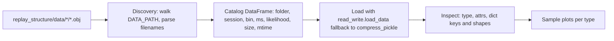

## Goal

Add a single, self-contained inspection notebook at [notebooks/Inspect_Data.ipynb](notebooks/Inspect_Data.ipynb) that:

1. Discovers every `.obj` file under [replay_structure/data/](replay_structure/data).
2. Loads each one (plain `pickle.load`, with a `compress_pickle` fallback) and groups them by subfolder.
3. Reports type, attributes, dict-key shapes, and sizes in tidy DataFrames.
4. Plots a few sanity-check figures per artifact type.

## Key facts gathered from the codebase

- All `.obj` files in `replay_structure/data/...` are written via `save_data` in [replay_structure/read_write.py](replay_structure/read_write.py) — i.e. plain `pickle.dumps`, NOT compressed. `save_compressed_data` is used elsewhere.
- Filename patterns are deterministic and parsed by the existing `load_*_data` helpers in [replay_structure/read_write.py](replay_structure/read_write.py):
  - `data/ratday/{session}_{bin}cm.obj` → `RatDay_Preprocessing`
  - `data/ripples/{session}_{bin}cm_{ms}ms.obj` → `Ripple_Preprocessing`
  - `data/run_snippets/{session}_{bin}cm_{ms}ms.obj` → `Run_Snippet_Preprocessing`
  - `data/high_synchrony_events/{session}_{bin}cm_{ms}ms.obj` → `HighSynchronyEvents_Preprocessing`
  - `data/placefieldID_shuffle/{session}_{bin}cm_{ms}ms.obj` → shuffle variant of `Ripple_Preprocessing`
  - `data/structure_analysis_input/{session}_{datatype}_{bin}cm_{ms}ms_{likelihood}.obj` → `Structure_Analysis_Input`
- Concrete files currently present (from `dir /s /b replay_structure\data`):
  - ratday: `rat0day4_4cm.obj`, `rat1day1_4cm.obj`, `rat2day1_4cm.obj`
  - ripples: `rat1day1_4cm_3ms.obj`, `rat2day1_4cm_3ms.obj`
  - run_snippets: `rat1day1_4cm_60ms.obj`
  - high_synchrony_events: `rat1day1_4cm_3ms.obj`
  - placefieldID_shuffle: `rat1day1_4cm_3ms.obj`
  - structure_analysis_input: `rat1day1_ripples_4cm_3ms_poisson.obj`, `rat2day1_ripples_4cm_3ms_poisson.obj`

## Data-flow overview



## Notebook cell layout

1. Markdown title + brief explainer linking to [replay_structure/read_write.py](replay_structure/read_write.py).
2. Imports + path setup:
   - `from replay_structure.metadata import DATA_PATH, Ripples, Run_Snippets, HighSynchronyEvents, PlacefieldID_Shuffle` (add only what exists; verify via `metadata.py`).
   - `from replay_structure.read_write import load_data, load_compressed_data, load_ratday_data, load_spikemat_data, load_structure_data`.
   - `import pandas as pd, numpy as np, matplotlib.pyplot as plt, pickle, re, os`.
3. Discovery + catalog cell:
   - Walk `DATA_PATH.glob('*/*.obj')`, parse `{session}_{bin}cm[_{ms}ms[_{likelihood}]]` with one regex, build a `pd.DataFrame` with columns `[folder, filename, path, session, bin_size_cm, time_window_ms, likelihood, size_kb, mtime]`. Display.
4. Robust loader helper:
   ```python
   def safe_load(path):
       try: return load_data(path, print_filename=False)
       except Exception:
           return load_compressed_data(path, print_filename=False)
   ```
5. Bulk load cell — load every catalog row into a `loaded: dict[Path, Any]` and add `cls_name` / `repr_short` columns to the catalog.
6. Generic inspector helper `describe(obj)` that prints `type(obj)`, `vars(obj).keys()` (or `dir()`), and for any `dict` attribute prints `{k: (type, shape_or_len)}`.
7. Per-folder typed inspection sections (one markdown header + 1-2 code cells each):
   - `ratday/` — for each: `describe(rd)`, head of `rd.data` keys, and `imshow(rd.place_field_data['place_fields'][:, :, 0])` for a sample cell; print `n_place_cells`, `n_ripples`.
   - `ripples/` and `placefieldID_shuffle/` — `describe(rp)`, list `rp.ripple_info` keys, `imshow` first popburst spikemat, plot `popburst_mean_firing_rate_array` histogram.
   - `run_snippets/` — same shape inspection adapted to its `data` dict.
   - `high_synchrony_events/` — same pattern.
   - `structure_analysis_input/` — `describe(sai)`, `imshow(sai.pf_matrix)`, `len(sai.spikemats)`, sample `sai.spikemats[0]` heatmap, print `sai.params`.
8. Final summary cell — produce a single DataFrame: `[folder, filename, class, n_items_or_shape, key_attrs]` for at-a-glance overview.

## Constraints / conventions

- Use `DATA_PATH` from `replay_structure.metadata` so the notebook works without hard-coded paths.
- Keep all function calls on a single line where reasonable.
- Two blank lines between any helper functions defined in the notebook.
- Don't mutate any existing notebooks.

## Out of scope

- No edits to `replay_structure/` source.
- No new dependencies.
- No results-folder loading (the user only asked about `data/`).